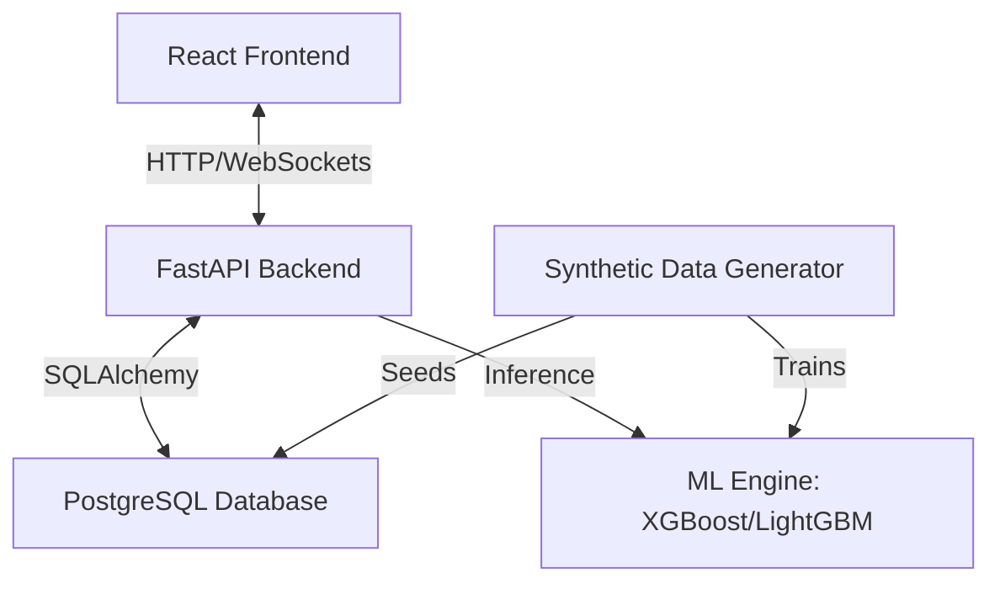

# Implementation Plan - ReBid AI: AI-Powered Reverse Procurement Platform

ReBid AI is a real-time reverse auction B2B procurement platform. Instead of simply selecting the lowest bidder, it combines a WebSocket-based live auction with an AI-driven vendor scoring engine (using XGBoost/LightGBM) to recommend the best supplier based on price, reliability, delivery, and historical performance. It also includes collusion/fraud detection and a tamper-evident cryptographic audit trail.

---

## User Review Required

Please review the proposed architecture, database design, and machine learning approach. Let us know if you would like any specific changes to the schema, ML features, or system architecture.

---

## Proposed Changes

We will build the project from scratch in the workspace directory. The layout will include a FastAPI backend, a React frontend, and a dedicated data generation/ML pipeline.

### Component 1: Database & Synthetic Data Generator

We will create a script to generate a rich synthetic database of historical vendors, auctions, and bids. This data will be used to train the machine learning models and populate the application.

#### [NEW] [schema.py](file:///e:/rebid%20neha/backend/app/models/schema.py)
This file will define the SQLAlchemy database models:
- **User**: User accounts with Role-Based Access Control (Buyer, Vendor, Admin).
- **VendorProfile**: Extra profiles for vendors (reliability score, delivery performance score, category, history).
- **ProcurementRequest**: Posted by Buyers detailing requirements (item, specifications, quantity, max budget, deadline).
- **Auction**: Active reverse auctions mapped to procurement requests.
- **Bid**: Live bids submitted by vendors during an auction.
- **AuditTrail**: Tamper-evident log. Each entry contains a `hash`, `previous_hash`, `timestamp`, `action`, and `data` (JSON).
- **FraudAlert**: Log of detected collusion or anomalous bidding behavior.

#### [NEW] [generate_synthetic_data.py](file:///e:/rebid%20neha/data/generate_synthetic_data.py)
A Python script that generates synthetic B2B procurement data:
- **Historical Vendors**: Ratings (3.0 to 5.0), past completion rate, average delay in days, defect rate.
- **Historical Auctions & Bids**: Multi-round bidding data. Some auctions will contain simulated fraud (e.g., collusion where two vendors bid exactly the same amount, or submit bids within 1 second of each other).
- **Seeding Script**: Seeds the local PostgreSQL database using SQLAlchemy.

---

### Component 2: Machine Learning Engine

We will build a machine learning pipeline to rank vendors and detect collusion.

#### [NEW] [ml_engine.py](file:///e:/rebid%20neha/backend/app/ml/ml_engine.py)
- **Vendor Scoring (XGBoost/LightGBM)**: Trains a model on historical procurement awards to predict the likelihood of successful contract execution. Features include:
  - `bid_price` (normalized against request budget)
  - `vendor_reliability`
  - `delivery_performance` (past delays)
  - `defect_rate`
  - `historical_rating`
  The model outputs a probability/suitability score, which is used to rank vendors.
- **Collusion / Anomaly Detection**: Trains an Isolation Forest or XGBoost classifier to detect suspicious bidding patterns, such as:
  - Rapid bidding sequences (bids within milliseconds of each other).
  - High correlation in bid prices between specific vendors.
  - Alternating bids showing a fixed decrement pattern (collusion/price-fixing).

---

### Component 3: FastAPI Backend

#### [NEW] [main.py](file:///e:/rebid%20neha/backend/app/main.py)
FastAPI application entry point.

#### [NEW] [websocket.py](file:///e:/rebid%20neha/backend/app/services/websocket.py)
Manages live auction rooms, broadcasting bids in real time, updating the vendor leaderboard.

#### [NEW] [audit.py](file:///e:/rebid%20neha/backend/app/services/audit.py)
Implements the tamper-evident audit trail. Each time a bid is submitted or an auction is finalized:
1. Retrieve the latest audit trail log hash.
2. Construct a string from the new log data + previous hash.
3. Compute the SHA-256 hash and insert the new record.

---

### Component 4: React Frontend (Vite)

#### [NEW] [app](file:///e:/rebid%20neha/frontend)
A responsive React dashboard styled with Vanilla CSS/custom design tokens featuring:
- **Buyer Portal**: Create auction, live view, AI recommendation breakdown, contract award.
- **Vendor Portal**: Live reverse-auction room using WebSockets, leaderboard, profile overview.
- **Admin Portal**: User verification, fraud/collusion alerts dashboard, system activity audit logs.

---

## Verification Plan

### Automated Verification
- We will write verification scripts in the `data/` and `backend/` directories to train models, evaluate scoring parameters, and verify the integrity of the cryptographic audit trail.

### Manual Verification
- We will test the WebSocket connection by running simultaneous bidding sessions.
- We will inspect the AI vendor scoring rankings and fraud alert flags in the admin panel.
