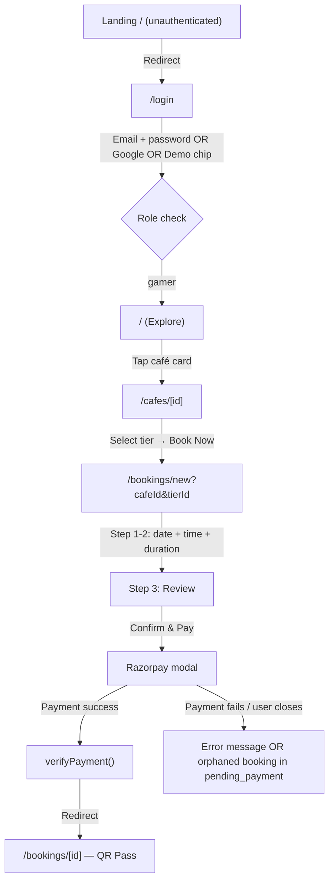
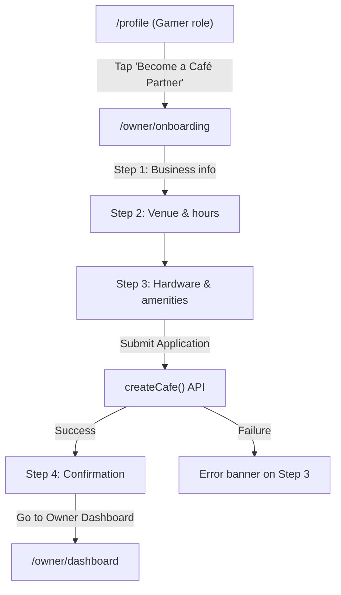

# KHEL-O Production Audit Report

**Date**: 2026-08-01  
**Auditor**: Antigravity AI  
**Scope**: Live prototype ([play-to-pitch.lovable.app](https://play-to-pitch.lovable.app)) + production codebase (`e:\KHEL-O`)  
**Method**: Browser walkthrough of prototype + static analysis of all 19 frontend pages, 13 backend services, auth store, and routing guards

---

## SECTION 1: COMPLETE SCREEN MAP

### Auth Route Group `(auth)`

| # | Screen Name | Route | How to Reach | Actions Available | Destination |
|---|-------------|-------|--------------|-------------------|-------------|
| 1 | **Login** | `/login` | Unauthenticated redirect, or "Logout" | Google Sign-In, Email/Password login, Demo account chips (Gamer/Owner/Admin), "Register here" link | Gamer→`/`, Owner→`/owner/dashboard`, Staff→`/owner/bookings`, Admin→`/admin` |
| 2 | **Register** | `/register` | "Register here" link on Login | Create new account form | `/login` on success |

---

### Customer Route Group `(customer)`

| # | Screen Name | Route | How to Reach | Actions Available | Destination |
|---|-------------|-------|--------------|-------------------|-------------|
| 3 | **Explore (Home)** | `/` | Login as gamer, bottom nav "Explore" | Search cafés, filter by intent chips, scroll featured/nearby/trending/recommended, tap café card, "Become a partner" CTA | Café Detail `/cafes/[id]`, Partner onboarding `/owner/onboarding` |
| 4 | **Café Detail** | `/cafes/[id]` | Tap café card on Explore | View photos, description, hardware tiers, amenities, reviews, operating hours; select a tier; tap "Book Now" | Booking Wizard `/bookings/new?cafeId=X&tierId=Y` |
| 5 | **Booking Wizard** | `/bookings/new?cafeId=X&tierId=Y` | "Book Now" on Café Detail | Step 1–2: Pick date (14-day), time slot (4 buckets), duration (1–8h); Step 3: Review summary, add notes, Confirm & Pay | Payment → `/bookings/[id]` (booking pass) |
| 6 | **Bookings List** | `/bookings` | Bottom nav "Bookings" | Toggle Upcoming/Past, view booking cards, Cancel booking (modal), View Pass, tap card for detail | `/bookings/[id]`, Cancel modal |
| 7 | **Booking Detail (Pass)** | `/bookings/[id]` | Tap "View Pass" or booking card, post-payment redirect | View QR code (confirmed), booking reference, session details, total paid; Back to bookings | `/bookings` |
| 8 | **Rewards** | `/rewards` | Bottom nav "Rewards" | View "Coming Soon" placeholder | None (static placeholder) |
| 9 | **Profile** | `/profile` | Bottom nav "Profile" | View avatar/name/email/role/phone/member-since; Quick Actions: Rewards, History, Help & Support; "Become a Café Partner" CTA (gamer only); Settings: Notifications, Privacy, Terms (all `alert()`), Logout (modal) | `/rewards`, `/bookings`, `/owner/onboarding`, `/login` (logout) |

---

### Owner Route Group `(owner)`

| # | Screen Name | Route | How to Reach | Actions Available | Destination |
|---|-------------|-------|--------------|-------------------|-------------|
| 10 | **Onboarding Wizard** | `/owner/onboarding` | "Become a Café Partner" on Profile or Home | Step 1: Business name, email, phone, PAN, GST; Step 2: Address, city, hours, seats; Step 3: Flagship rig tier, GPU, price, description; Step 4: Success confirmation | `/owner/dashboard` |
| 11 | **Owner Dashboard** | `/owner/dashboard` | Login as owner, sidebar "Dashboard" | View KPIs (today's revenue, active sessions, total bookings); Quick Actions grid (Café Profile, Hardware Tiers, Bookings, Promotions, Staff, Payout & KYC); Recent bookings list | `/owner/cafe`, `/owner/tiers`, `/owner/bookings`, `/owner/promotions`, `/owner/staff`, `/owner/payouts` |
| 12 | **My Café** | `/owner/cafe` | Sidebar "My Café" | Edit café profile details, photos, amenities | N/A |
| 13 | **Hardware Tiers** | `/owner/tiers` | Sidebar "Hardware Tiers" | View tier list, toggle active/inactive, create/edit tier (bottom sheet modal) | N/A |
| 14 | **Owner Bookings** | `/owner/bookings` | Sidebar "Bookings" | Search by ref/notes, filter Today/Upcoming/All, Mark Complete, Mark No Show | N/A |
| 15 | **Promotions** | `/owner/promotions` | Sidebar "Promotions" | Create promotion (discount slider, dates, day toggles, hours, usage cap), toggle active, delete (inline confirm) | N/A |
| 16 | **Staff Management** | `/owner/staff` | Sidebar link or dashboard quick action | Add staff accounts, view staff list | N/A |
| 17 | **Payouts & KYC** | `/owner/payouts` | Dashboard quick action | Bank account setup for Razorpay Route splits | N/A |

---

### Admin Route Group `(admin)`

| # | Screen Name | Route | How to Reach | Actions Available | Destination |
|---|-------------|-------|--------------|-------------------|-------------|
| 18 | **Admin Panel** | `/admin` or `/admin/cafes` | Login as admin | View stats (Total, Pending, Verified, Rejected); Toggle Pending/All tabs; Approve café, Reject (with reason textarea), Suspend (with confirmation), Re-evaluate (for non-pending) | N/A (inline actions) |

---

### Navigation Chrome

| Element | Location | Behaviour |
|---------|----------|-----------|
| **Top App Bar** (Customer) | Fixed top, all customer screens | KHEL-O logo → `/`, City badge "Bengaluru" (static), Bell icon (no action) |
| **Bottom Nav** (Customer) | Fixed bottom, hidden on `/bookings/new` | Explore `/`, Bookings `/bookings`, Rewards `/rewards`, Profile `/profile` |
| **Owner Sidebar** (Desktop) | Left rail, `md+` | Dashboard, My Café, Hardware Tiers, Bookings, Promotions; "Exit to Gamer View" → `/` |
| **Owner Bottom Nav** (Mobile) | Fixed bottom, `<md` | Same items as sidebar; Staff-only: "Bookings & Scan" only |
| **Admin Header** | Fixed top | "KHEL-O Admin Governance", "Exit to Marketplace" → `/` |

---

## SECTION 2: USER FLOW ANALYSIS

### Flow A — Guest to Booked

**Step-by-step trace**:

1. User visits `/`. Customer layout checks `isHydrated && !isLoading && !isAuthenticated` → redirects to `/login`.
2. Login page: email/password form, Google OAuth, or demo chip. No phone/OTP in production codebase (prototype uses phone/OTP — **divergence**).
3. On success: `setAuth()` stores to `localStorage` + Zustand. Role routing: `gamer → /`, `cafe_owner → /owner/dashboard`, `admin → /admin`.
4. Explore page loads with Intent Selector chips and café cards. Search is debounced.
5. Tap a café card → `/cafes/[id]`. Photo carousel, tier selector, sticky "Book Now" action sheet.
6. "Book Now" navigates to `/bookings/new?cafeId=X&tierId=Y`.
7. Wizard Steps 1–2 (unified view): 14-day horizontal date picker, 4-bucket time grid, 8 duration chips, session end time preview, estimated price.
8. CTA "Proceed to Review & Checkout" → Step 3. Review card, promo flash badge if applicable, full price breakdown (base, discount, platform fee ₹10, gateway fee 2%), optional notes, terms mention.
9. "Confirm and Pay" → `createBooking()` API → `createPaymentOrder()` → Razorpay modal → `verifyPayment()` → redirect to `/bookings/[id]`.
10. Booking detail page: status badge, QR code (via `api.qrserver.com`), session details, total paid.

> [!WARNING]
> **Confusion Points**:
> - **Step indicator is misleading**: Steps 1 and 2 are visually merged into one screen (both render when `currentStep === 1 || 2`), but the progress dots show "Step 1 of 2". The user never actually experiences a distinct "Step 2" transition. The `currentStep` state can be `1` or `2` but renders identical content.
> - **Back button from Step 3 goes to Step 1** (line 298-299: `setCurrentStep(1)`), not Step 2. This skips the logical "previous step" mental model.
> - **Back button from Steps 1/2 navigates to café detail** (`/cafes/${cafeId}`), which is correct but loses all wizard state without warning.

---

### Flow B — Gamer to Café Owner

**Step-by-step trace**:

1. Profile page renders "OWN A GAMING CAFÉ?" CTA only when `user.role === 'gamer'` or role is undefined.
2. Clicking "Become a Café Partner" routes to `/owner/onboarding`.

> [!CAUTION]
> **Critical gap**: The onboarding page lives under the `(owner)` route group, which has a layout guard at line 26: `user?.role !== 'cafe_owner' && user?.role !== 'admin' && user?.role !== 'staff'` → redirect to `/`. **A gamer cannot access this page** because their role is `gamer`, and the owner layout will redirect them back to `/` before the onboarding content renders. The "Become a Café Partner" button leads to an infinite redirect loop.

3. *If* a gamer could access it: 3-step wizard (Business → Venue → Hardware) → `createCafe()` API call.
4. Backend `POST /api/v1/cafes` reportedly auto-upgrades gamer role to `cafe_owner` (per HANDOFF ADR 009).
5. Step 4 success screen shows "Unverified Partner Access Granted" with limits (15 bookings, ₹5,000 cap).
6. CTA navigates to `/owner/dashboard`.

**What happens on admin rejection**: There is **no notification mechanism** to the owner. The dashboard shows a `verificationBadge` ("✗ Verification Rejected" / "⚠ Suspended"), but no rejection reason is surfaced to the owner. The admin panel captures a rejection reason, but the owner dashboard doesn't fetch or display it.

**What the user sees while pending**: Owner dashboard shows "⏳ Verification Pending" badge. All dashboard features remain accessible (with unverified caps enforced server-side).

---

### Flow C — Owner Operations

**Manage café details**: Dashboard → Quick Action "Café Profile" → `/owner/cafe`. Edit name, address, hours, photos, amenities.

**Manage hardware tiers**: Dashboard → "Hardware Tiers" → `/owner/tiers`. Two-panel: list view + bottom sheet form modal for create/edit. Toggle switch for active/inactive.

**Create a flash promotion**: Dashboard → "Promotions" → `/owner/promotions`. Bottom sheet modal: title, discount slider (1–50%), discount type, date pickers, day toggles, start/end hours, usage cap. Active toggle. Delete with inline confirmation.

**View bookings**: Dashboard → "Bookings" → `/owner/bookings`. Search by ref/notes, filter by Today/Upcoming/All. Each booking card shows gamer name, tier, date/time, status pill.

**Check in a gamer**: On `/owner/bookings`, confirmed booking cards have "Mark Complete" and "No Show" quick action buttons. No QR scanning UI exists in this page — the HANDOFF mentions QR scanning mechanics, but the frontend at `/owner/bookings` only has status update buttons, not a camera/scanner view.

> [!WARNING]
> **QR Check-in gap**: The booking pass page generates QR codes containing `KHELO:{bookingRef}:{bookingId}`, and HANDOFF mentions "QR scanning mechanics in the Owner Hub". However, no QR scanner component exists in the frontend codebase. The owner/staff must manually find the booking and click "Mark Complete". The QR code on the gamer's pass has no corresponding scan endpoint.

---

### Flow D — Admin Governance

**Pending café queue**: Admin panel at `/admin` loads all cafés via `getPendingCafes()`. "Pending" tab filters to `verificationStatus === 'pending'`.

**Review submission**: Each café card shows: owner name/email/phone, café name, address, hours, seats, description, amenities, photos, submitted date.

**Approve**: "Approve" button → `verifyCafe(cafeId, 'verified', null)` → mutation invalidates query → card refreshes.

**Reject**: "Reject" button → textarea appears → "Confirm Reject" (requires non-empty reason) → `verifyCafe(cafeId, 'rejected', reason)`.

**Suspend**: "Suspend" button → confirmation text "Confirm café suspension?" → "Yes, Suspend" → `verifyCafe(cafeId, 'suspended', null)`.

**Re-evaluate**: On "All Cafés" tab, non-pending cafés show "Re-evaluate" button → re-renders Approve/Reject/Suspend buttons for that card.

> [!IMPORTANT]
> **No suspension reason captured**: Suspension happens with `reason: null`. Unlike rejection, the admin cannot provide a suspension reason. The owner gets no explanation.

---

## SECTION 3: LOGICAL INCONSISTENCIES

### ROLE TRANSITIONS

| Issue | Severity | Detail |
|-------|----------|--------|
| **Gamer cannot access onboarding page** | 🔴 CRITICAL | Owner layout guard at [layout.tsx:26](file:///e:/KHEL-O/frontend/src/app/(owner)/layout.tsx#L26) blocks `gamer` role. The "Become a Café Partner" button on Profile navigates to `/owner/onboarding`, which lives inside the owner route group. Gamer gets silently redirected to `/`. |
| **Role not refreshed after cafe creation** | 🟡 HIGH | Backend upgrades role to `cafe_owner` on `createCafe()`, but the frontend `authStore` still has the stale `gamer` role cached in localStorage and Zustand. Without re-fetching `/me` and updating the store, the user remains unable to access owner pages even after successful submission. |
| **Suspended café owner can still access dashboard** | 🟡 HIGH | Owner layout guard checks `user.role === 'cafe_owner'` — suspension changes `cafe.verificationStatus`, not `user.role`. A suspended owner retains full dashboard access. Only the dashboard badge changes. Backend caps may limit bookings, but the UI gives no functional restriction. |
| **Admin cannot be locked out** | 🟢 LOW | Admin layout strictly checks `user.role === 'admin'`. No self-demotion flow exists, and admin can only act on cafés, not users. Risk is negligible. |

### BOOKING EDGE CASES

| Issue | Severity | Detail |
|-------|----------|--------|
| **Payment failure leaves orphaned booking** | 🔴 CRITICAL | `createBooking()` on Step 3 creates a `PENDING_PAYMENT` booking in the database before Razorpay modal opens. If Razorpay modal is closed, payment creation fails, or `verifyPayment()` throws, the booking sits permanently as `PENDING_PAYMENT`. No TTL, no auto-cancel, no cleanup job. This booking counts against seat availability, progressively blocking all slots. |
| **Payment order creation failure silently succeeds** | 🟡 HIGH | At [line 96-99](file:///e:/KHEL-O/frontend/src/app/(customer)/bookings/new/page.tsx#L96-L99), if `createPaymentOrder()` throws, the catch block navigates to `/bookings/${booking.id}` — displaying a booking pass for an unpaid booking. The gamer sees a QR code for a booking that was never paid for. |
| **No closing-time session overflow validation** | 🟡 HIGH | Client-side: `isEndTimeOverClosing` is computed but never used to block the CTA or show a warning. Server-side: [booking_service.py](file:///e:/KHEL-O/backend/app/services/booking_service.py#L70-L71) calculates `end_time` but never validates it against `cafe.closing_time`. A user can book 8 hours starting at 9 PM when the café closes at 11 PM. |
| **Promotion expiry between Steps 1–3** | 🟡 MEDIUM | Promotion is applied client-side from `cafe.activePromotions[0]` cached during initial page load. If the promo expires or exhausts between loading and clicking "Confirm", the backend returns `PROMOTION_EXHAUSTED`. Error handling exists (line 113-114): message shown, stays on Step 3. **However**, the price breakdown still shows the discounted total. User must manually re-click "Confirm" to resubmit without the promo. |
| **30-minute advance boundary race** | 🟡 MEDIUM | Client-side `isSlotDisabled()` disables past slots, but uses the browser's local clock. Server validates against UTC (`datetime.now(timezone.utc)`). If the user's clock is ahead/behind or in IST (UTC+5:30), the 30-min window may allow slots the server rejects (or vice versa). The server at [line 56](file:///e:/KHEL-O/backend/app/services/booking_service.py#L56) also combines date+time in UTC but the session date is a local calendar date — timezone mismatch. |
| **Café deactivation mid-booking** | 🟢 LOW | If `is_active` is set to false or `verification_status` changes to `REJECTED`/`SUSPENDED` between the user opening the wizard and clicking "Confirm", the backend correctly rejects with `CAFE_NOT_AVAILABLE`. The frontend shows a generic error. Existing confirmed bookings are not auto-cancelled. |

### NAVIGATION CONSISTENCY

| Issue | Severity | Detail |
|-------|----------|--------|
| **Wizard back button skips Step 2** | 🟡 MEDIUM | `handleBack()` from Step 3 sets `currentStep(1)`, not `currentStep(2)`. Since Steps 1 and 2 render the same content, this is functionally acceptable but logically incorrect — the state variable can be 1 or 2, and the back button always jumps to 1. |
| **Bottom nav active state incorrect for sub-routes** | 🟡 MEDIUM | At [layout.tsx:86-88](file:///e:/KHEL-O/frontend/src/app/(customer)/layout.tsx#L86-L88), `isActive` uses `pathname.startsWith(item.href)`. The Explore tab uses `href='/'` with an exact check (`pathname === '/'`). Visiting `/cafes/cafe-1` means **no tab is active** — the user sees an orphaned screen with no navigation highlight. |
| **Owner bottom nav uses exact match only** | 🟢 LOW | At [owner layout.tsx:120](file:///e:/KHEL-O/frontend/src/app/(owner)/layout.tsx#L120), `isActive = pathname === item.href`. Visiting `/owner/tiers` but clicking into a tier edit modal doesn't change the URL, so this is fine. But if sub-routes existed (e.g., `/owner/tiers/create`), the highlight would be lost. |
| **Deep-link to `/bookings/[id]` works** | ✅ OK | `useQuery` with `enabled: Boolean(bookingId)` handles the case. If the booking ID is invalid, the error state renders with a "Retry" button and "Back to My Bookings" link. Auth guard on the customer layout protects unauthenticated access. |
| **Deep-link to `/cafe/nonexistent`** | ✅ OK | Query returns error → error state card with "Return to Explore" CTA renders correctly. |

### DATA FRESHNESS

| Issue | Severity | Detail |
|-------|----------|--------|
| **Booking list updates after creation** | ✅ OK | `queryClient.invalidateQueries({ queryKey: ['bookings'] })` is called in both `onSuccess` (line 65) and after `verifyPayment()` (line 88). React Query will refetch. |
| **Owner booking status update not pushed to gamer** | 🟡 MEDIUM | When an owner marks a booking as "Completed" or "No Show", the gamer's bookings list is **not** updated in real-time. It uses `staleTime: 60_000` (1 minute) — the gamer must wait up to 60 seconds or manually refresh to see the status change. No WebSocket or push notification exists. |
| **Admin café approval not immediately discoverable** | 🟡 MEDIUM | After admin approves a café, the gamer-side Explore page uses `staleTime` on café list queries. The approved café won't appear until the cache expires and refetches. No event-driven invalidation. |

---

## SECTION 4: MISSING STATES

| Screen | Loading | Empty | Error | Success | Partial | Gaps |
|--------|---------|-------|-------|---------|---------|------|
| **Login** | `loading` bool disables button text "Logging in..." | N/A | Error banner (red box) | Redirect (no toast) | N/A | ⚠ No success toast/confirmation before redirect |
| **Register** | Not audited (separate page) | N/A | Likely similar | Likely redirect | N/A | — |
| **Explore** | CafeCardSkeleton exists | No explicit "no cafés found" empty state in [page.tsx](file:///e:/KHEL-O/frontend/src/app/(customer)/page.tsx) | ⚠ **Not verified** — no `isError` handling visible in explore page | N/A | N/A | 🔴 Missing error state. 🟡 Missing "no results" empty state for search |
| **Café Detail** | Skeleton exists in page | N/A | Error card with "Return to Explore" | N/A | ⚠ Missing state for partially loaded data (café loaded, tiers still fetching) | 🟡 No partial state |
| **Booking Wizard** | Skeleton for café loading | "Missing Reservation Details" for no query params | Error card for bad café/tier | N/A | N/A | ⚠ No success state — wizard immediately redirects on payment. No intermediate "Booking confirmed!" moment |
| **Bookings List** | 3x BookingCardSkeleton | Empty state per tab (Upcoming: "No upcoming sessions" + CTA; Past: "No past bookings") | Error card with "Try Again" | N/A | N/A | ✅ Complete |
| **Booking Detail** | Skeleton (animated pulse) | N/A | Error card with "Retry" + "Back to My Bookings" | Status-specific UI (QR for confirmed, message for others) | N/A | ✅ Complete |
| **Rewards** | N/A (static) | "Coming Soon" placeholder | N/A | N/A | N/A | ✅ Acceptable (placeholder) |
| **Profile** | Skeleton (pulse) | N/A | Error card with "Try Again" | N/A | `initialData: storedUser` provides fallback | ✅ Complete |
| **Onboarding Wizard** | `loading` bool on submit | N/A | Error banner (red box) | Step 4 success card | N/A | ✅ Complete |
| **Owner Dashboard** | Full skeleton (header + KPI cards + grid) | "No bookings yet" + "Set up your venue" (no café) | Error card (only shown if **both** café and bookings fail) | N/A | ⚠ If café loads but bookings fail (or vice versa), the error state is NOT shown (requires both to fail) | 🟡 Partial error masking |
| **Hardware Tiers** | Likely exists (not deeply audited) | Likely exists | Likely exists | Modal close on save | N/A | — |
| **Owner Bookings** | Likely exists | Likely exists | Likely exists | Status update inline | N/A | — |
| **Promotions** | Likely exists | Likely exists | Likely exists | Toggle/delete inline | N/A | — |
| **Staff Management** | Likely exists | Likely exists | Likely exists | N/A | N/A | — |
| **Payouts** | Likely exists | Setup form | Likely exists | N/A | N/A | — |
| **Admin Panel** | 2x SkeletonRow | "All clear!" (pending), "No cafés registered yet" (all) | Error card with "Try Again" | Inline spinner during mutation | N/A | ✅ Complete |

---

## SECTION 5: PRIORITISED FIXES

### 🔴 CRITICAL — Breaks core functionality or traps the user

#### C1: Gamer cannot access onboarding page

- **Problem**: The "Become a Café Partner" CTA on Profile navigates to `/owner/onboarding`, which is inside the `(owner)` route group. The owner layout guard at [layout.tsx:26](file:///e:/KHEL-O/frontend/src/app/(owner)/layout.tsx#L26) checks `user.role !== 'cafe_owner' && user.role !== 'admin' && user.role !== 'staff'` and redirects gamers to `/`. The user clicks the button and nothing visibly happens.
- **Why it matters**: This completely blocks the gamer→owner conversion funnel, the primary B2B growth mechanism.
- **Correct behaviour**: Either (a) move the onboarding page to a shared/customer route group, or (b) add `gamer` as an allowed role specifically for the `/owner/onboarding` path in the layout guard.

---

#### C2: Orphaned PENDING_PAYMENT bookings block seat availability

- **Problem**: `createBooking()` creates a booking record with `PENDING_PAYMENT` status before Razorpay opens. If payment is abandoned, the booking persists indefinitely and counts against `overlapping_count` in seat availability checks (the query at [booking_repository.py:68](file:///e:/KHEL-O/backend/app/repositories/booking_repository.py#L68) includes `PENDING_PAYMENT` in the status filter).
- **Why it matters**: Over time, abandoned payment attempts will phantom-fill all slots, making a café appear fully booked when it isn't. This is a silent, progressive failure.
- **Correct behaviour**: Implement a TTL (e.g., 15 minutes) on `PENDING_PAYMENT` bookings with a background job or lazy-check that auto-cancels expired unpaid bookings. Alternatively, create the booking only after payment verification succeeds.

---

#### C3: Unpaid booking shows QR pass to gamer

- **Problem**: If `createPaymentOrder()` fails at [line 97](file:///e:/KHEL-O/frontend/src/app/(customer)/bookings/new/page.tsx#L97), the catch block at line 98 navigates to `/bookings/${booking.id}`. The booking detail page at [bookings/[id]/page.tsx:60](file:///e:/KHEL-O/frontend/src/app/(customer)/bookings/[id]/page.tsx#L60) shows a QR code for `status === 'confirmed'` and a "Complete payment" message for other statuses. However, if the order creation succeeded but was abandoned, the booking is `PENDING_PAYMENT` and the page correctly shows the non-QR state. **But** the catch block silently hides the error — the user doesn't know payment failed.
- **Why it matters**: User sees a booking pass for a booking that may never be paid. Creates false expectation and potential walk-in disputes.
- **Correct behaviour**: Show an explicit error toast/banner when `createPaymentOrder()` fails. Navigate to `/bookings` (list) instead of the pass page. Show "Payment required" badge prominently.

---

### 🟡 HIGH — Causes confusion or incorrect data display

#### H1: Prototype login diverges from production codebase

- **Problem**: The live prototype at `play-to-pitch.lovable.app` uses phone number + OTP login (9876543210 / 1234). The production codebase at `e:\KHEL-O` uses email + password + Google OAuth. These are fundamentally different auth flows.
- **Why it matters**: Any feedback gathered from prototype testing does not validate the actual auth experience. Stakeholders and investors see a flow that doesn't exist in production.
- **Correct behaviour**: Either align the prototype to use email/password, or implement phone/OTP in the production backend.

---

#### H2: No closing-time overflow guard

- **Problem**: `isEndTimeOverClosing` is computed at [line 158-161](file:///e:/KHEL-O/frontend/src/app/(customer)/bookings/new/page.tsx#L158-L161) but never used to disable the CTA or warn the user. The backend also doesn't validate end time against `cafe.closing_time`.
- **Why it matters**: A user can book an 8-hour session starting at 7 PM for a café closing at 11 PM. The session would end at 3 AM.
- **Correct behaviour**: Disable duration chips that would overflow past closing time. Show a warning if end time exceeds closing time. Validate server-side.

---

#### H3: Role not refreshed after onboarding submission

- **Problem**: Backend upgrades user role on `createCafe()`, but frontend `authStore` keeps the stale `gamer` role. The user is told to "Go to Owner Dashboard" but may be redirected away by the owner layout guard.
- **Why it matters**: The conversion funnel appears broken even when the backend succeeds.
- **Correct behaviour**: After successful `createCafe()`, re-fetch `/api/v1/auth/me` and update the Zustand store before navigating.

---

#### H4: Rejection reason not surfaced to café owner

- **Problem**: Admin panel captures a rejection reason in a textarea, and the `verifyCafe()` API stores it. But the owner dashboard shows only a badge ("✗ Verification Rejected") — no reason text is fetched or displayed.
- **Why it matters**: Owner has no idea why they were rejected and no actionable path to fix their submission.
- **Correct behaviour**: Display the rejection reason in a card on the owner dashboard. Add a "Re-submit" CTA that navigates back to onboarding with pre-filled data.

---

#### H5: Explore page missing error and empty states

- **Problem**: The main Explore page at [page.tsx](file:///e:/KHEL-O/frontend/src/app/(customer)/page.tsx) renders café cards with skeleton loaders, but code inspection suggests no `isError` handling or "no cafés found" empty state exists for the main feed.
- **Why it matters**: If the API is down or returns no cafés (e.g., wrong city), the user sees a blank feed with no feedback.
- **Correct behaviour**: Add an error card with "Try Again" and an empty state with "No cafés found in your area".

---

#### H6: UTC timezone mismatch in 30-minute advance booking validation

- **Problem**: The server at [booking_service.py:55-58](file:///e:/KHEL-O/backend/app/services/booking_service.py#L55-L58) uses `datetime.now(timezone.utc)` and combines session_date + start_time in UTC. But session dates are local calendar dates (IST for Indian users). A booking at 10:00 AM IST on 2026-08-02 is treated as 10:00 AM UTC (actually 3:30 PM IST). The 30-minute window can allow or reject slots incorrectly.
- **Why it matters**: Users in IST see "That time slot has passed" errors for slots that appear available on their screen.
- **Correct behaviour**: Either store and compare times in IST consistently, or convert the user's local time to UTC before comparison.

---

### 🟠 MEDIUM — Suboptimal experience but recoverable

#### M1: Settings buttons use `alert()` instead of real screens

- **Problem**: Profile page: Notifications, Privacy & Security, and Terms buttons all use `alert('... coming soon!')`.
- **Why it matters**: Browser `alert()` dialogs look unpolished and jarring in a mobile-first app.
- **Correct behaviour**: Use a toast/snackbar component or navigate to a "Coming Soon" stub page.

---

#### M2: No bottom nav highlight on café detail page

- **Problem**: `/cafes/[id]` doesn't match any bottom nav item's `href` pattern. No tab is highlighted.
- **Why it matters**: User loses spatial orientation — they don't know which section of the app they're in.
- **Correct behaviour**: Highlight "Explore" tab for all `/cafes/*` routes.

---

#### M3: Owner dashboard partial error masking

- **Problem**: Error state at [dashboard/page.tsx:200](file:///e:/KHEL-O/frontend/src/app/(owner)/owner/dashboard/page.tsx#L200) only renders if **both** `isCafeError && isBookingsError` are true. If only one fails, the dashboard partially renders with stale/missing data and no error indication.
- **Why it matters**: Owner sees ₹0 revenue or 0 bookings and thinks the business has no activity, when actually the API call failed.
- **Correct behaviour**: Show individual error banners for each failing data source.

---

#### M4: Notification bell is non-functional

- **Problem**: Bell icon in customer top bar has no click handler — `aria-label="Notifications"` but no `onClick`.
- **Why it matters**: Trained affordance — users will tap it expecting something to happen.
- **Correct behaviour**: Either add a notifications panel/page or remove the bell icon until notifications are implemented.

---

#### M5: No cancellation refund flow

- **Problem**: Booking cancellation at [booking_service.py:201-230](file:///e:/KHEL-O/backend/app/services/booking_service.py#L201-L230) changes status to `CANCELLED` but initiates no Razorpay refund. The 2% cancellation fee mentioned in HANDOFF is not implemented.
- **Why it matters**: Users who cancel don't get their money back. No refund webhook or API call is triggered.
- **Correct behaviour**: Trigger a Razorpay refund (minus any cancellation fee) when a confirmed booking is cancelled. Display refund status on the booking detail page.

---

#### M6: Promotion discount auto-applies first promotion blindly

- **Problem**: At [line 171](file:///e:/KHEL-O/frontend/src/app/(customer)/bookings/new/page.tsx#L171), the wizard uses `cafe.activePromotions[0]` — the first promotion in the array. There is no user choice, no promo code input, no eligibility check.
- **Why it matters**: Promotions may have day/time restrictions that the frontend doesn't validate. A "Weekend Only" promo could be auto-applied on a Wednesday.
- **Correct behaviour**: Validate promo eligibility (day, time, date range) client-side before displaying. Consider adding a promo code input or multi-promo selector.

---

#### M7: "Become a partner" text below CTA is misleading

- **Problem**: Below the "Become a Café Partner" CTA on Profile, text reads: "Already a partner? Sign in with your owner account." This implies a separate account, but the system uses role-based access on the same account.
- **Why it matters**: Users may try to create a second account or look for a "switch account" option that doesn't exist.
- **Correct behaviour**: Remove the misleading copy or replace with "Your account will be upgraded to Café Owner status."

---

#### M8: Suspension has no reason field

- **Problem**: Admin suspension action sends `reason: null`. Unlike rejection, there's no textarea to capture why a café was suspended.
- **Why it matters**: Suspension is a more serious action than rejection. The owner has no explanation or appeal path.
- **Correct behaviour**: Add a required reason textarea for suspension, mirroring the rejection flow.

---

### 🟢 LOW — Polish and nice-to-have

#### L1: No booking success toast/interstitial

- **Problem**: After payment verification, the user is immediately redirected to the booking pass page. There's no "🎉 Booking Confirmed!" celebration moment.
- **Why it matters**: Payment completion is a high-emotion moment. Instant redirect feels abrupt.
- **Correct behaviour**: Show a brief success animation/confetti interstitial before redirecting to the pass.

---

#### L2: QR code uses external API

- **Problem**: QR codes are generated via `https://api.qrserver.com/v1/create-qr-code/`. This is a third-party dependency with no SLA.
- **Why it matters**: If the service is down, booking passes render without QR codes. Also raises data privacy concerns — booking IDs and references are sent to an external service.
- **Correct behaviour**: Generate QR codes client-side using a library like `qrcode.react`.

---

#### L3: "Good morning" is always displayed on owner dashboard

- **Problem**: The greeting at [dashboard/page.tsx:228](file:///e:/KHEL-O/frontend/src/app/(owner)/owner/dashboard/page.tsx#L228) always says "Good morning" regardless of time of day.
- **Why it matters**: Minor polish issue that makes the UI feel static.
- **Correct behaviour**: Derive greeting from current time (morning/afternoon/evening).

---

#### L4: Google Sign-In error handling has raw `any` cast

- **Problem**: At [login/page.tsx:70](file:///e:/KHEL-O/frontend/src/app/(auth)/login/page.tsx#L70), `(window as any).google` is used despite the project rule of zero `any`. The HANDOFF claims all `any` types were eliminated, but this one persists.
- **Why it matters**: Violates the project's TypeScript strictness policy documented in ADR 010.
- **Correct behaviour**: Use the typed window augmentation already partially in place at line 93.

---

#### L5: Owner layout "Exit to Gamer View" is misleading for staff

- **Problem**: The owner sidebar's exit link says "Exit to Gamer View" and navigates to `/`. Staff users don't have a "gamer view" — they only have access to `/owner/bookings`.
- **Why it matters**: Staff clicking "Exit to Gamer View" are redirected to Explore (customer area) or may face auth issues since staff isn't in the customer layout guard's allowlist.
- **Correct behaviour**: Conditionally label as "Exit" for staff, or redirect staff to `/login`.

---

#### L6: Cancellation modal doesn't show booking details

- **Problem**: The cancellation confirmation modal on the bookings list says "Are you sure you want to cancel?" but doesn't show which booking (café name, date, time) is being cancelled.
- **Why it matters**: If a user has multiple bookings, they may cancel the wrong one.
- **Correct behaviour**: Include booking reference, café name, and date/time in the modal.

---

#### L7: No QR scanner component despite HANDOFF claim

- **Problem**: HANDOFF ADR 006 says "Integrated mobile-friendly QR scanning mechanics in the Owner Hub" and ADR 009 mentions "delegation of QR check-in capabilities to venue staff." No camera/scanner component exists in the frontend codebase.
- **Why it matters**: HANDOFF documentation is misleading; the QR check-in feature is not implemented.
- **Correct behaviour**: Either implement a QR scanner using a library like `html5-qrcode` on the owner bookings page, or update HANDOFF to accurately reflect current state.

---

### Summary Counts

| Severity | Count |
|----------|-------|
| 🔴 Critical | 3 |
| 🟡 High | 6 |
| 🟠 Medium | 8 |
| 🟢 Low | 7 |
| **Total** | **24** |
